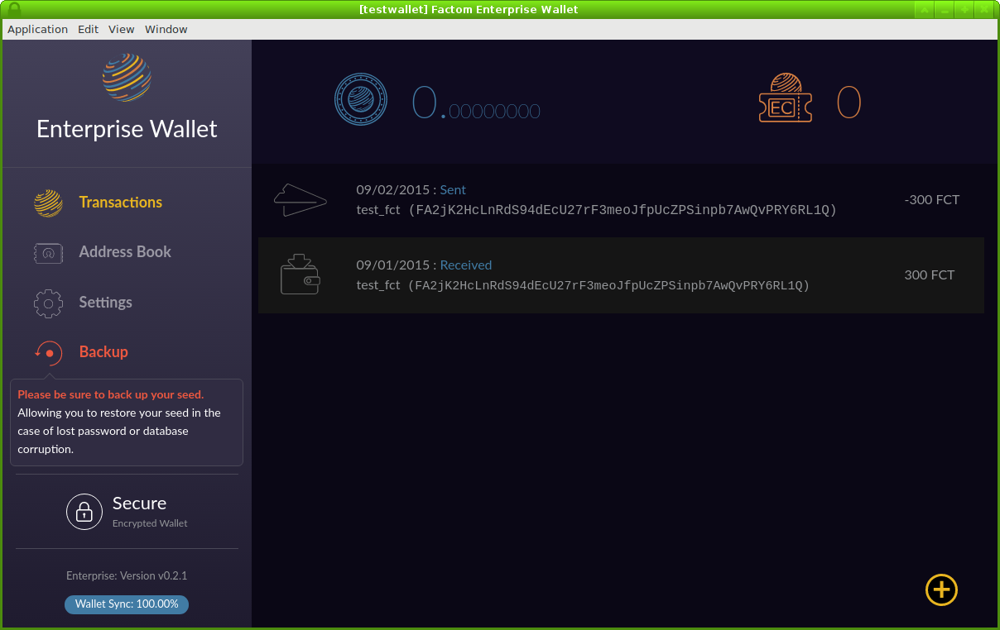
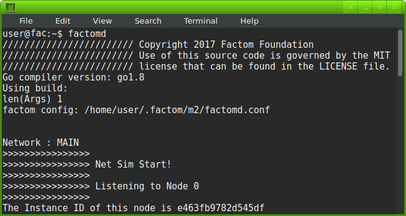

## Factom Binaries

The latest version of Factom is version **6.3.3**, released **26 July, 2019**

The latest version of Enterprise Wallet is Version **0.3.1**, released **19 September, 2019**

Install guide located [here](https://docs.factom.com/wallet#install-factom-federation-ff).

### Factom Enterprise Wallet

| OS | Enterprise Installer | sha256sum |
|----|-----|-----|
| Windows 64bit | [enterprise-wallet-setup-amd64.exe](https://github.com/FactomProject/distribution/releases/download/v6.3.1/enterprise-wallet-setup-amd64.exe) | 9f56e9a8639d60212fb697a896ba182ceb351a2a5efe145e38422d0f35360df1 |
| Mac |  [enterprise-wallet-setup.dmg](https://github.com/FactomProject/distribution/releases/download/v6.3.1/enterprise-wallet-setup.dmg) | 12864f556b1e21d88d0f7cf384959ccd34602a4ea6b133fe6daa9262e845e0ff |
| Linux (Ubuntu/Debian) 64bit | [enterprise-wallet-setup-amd64.deb](https://github.com/FactomProject/distribution/releases/download/v6.3.1/enterprise-wallet-setup-amd64.deb) | eff646583d1a69140a91553f0b7e7dcf9b3f75934abb63be9e5adfac5f94b2ac |
| Linux (Redhat/Centos) | [enterprise-wallet-linux.zip](https://github.com/FactomProject/distribution/releases/download/v6.3.1/enterprise-wallet-linux.zip) | 0ca6c882196a2dfc637cd17ce53042b27c915f70a2e5f37ce601670e567ed5fe |

#### Release notes for v0.3.1
Frontend Changes:
* General
    * logos updated to new Factom logo
* Launcher
    * some wording changed (transfering factoids and footer)
* Wallet
    * Wording changes
    * FCT/EC logos replaced with text
    * Yellow (+) button on Transactions/Address Book now always popped out
      for visibility
    * Settings
        * Sync Method revamped to include Factomd Open Node and https support
          for the courtesy node
        * Custom input allows entry of the scheme, just prefix the address
          with "http://" or "https://" (For localhost https support, please
          refer to the factomd.conf settings)
        * New default factdom endpoint (open node)
        * "Custom" API Endpoint now sanitizes input into accepted format
       (Prepends http:// if no scheme specified, removes trailing slashes)
    * Send Factoids / Buy EC
        * No longer requires you to click a button to preview the transaction,
          updates as you type
        * Clicking send now takes you to a confirmation prompt
        * Wording changes of error messages and some of the UI elements
        * Address Book popout now allows you to click on an address to select it
    * Address Book and other popups open faster
    
Backend Changes:
* Dramatic speed improvements to the "Transaction" tab after the first initial
  loading. For more details see: 
  https://github.com/FactomProject/factom/issues/85
* https support
* Temporary (60 seconds) caching of balance requests to reduce factomd requests

#### Release notes for v0.2.1
- [new] added splash screen displaying license

Known issue:
If the zip based linux wallet is run as a fresh install, a blank white screen is shown on startup.

#### Release notes for v0.2.0.0
- [new] added a password protected, encrypted wallet option
- [new] revamped the seed backup and restore processes, no longer exposing their 12 words on the user's hard drive
- [new] a fresh coat of paint! Cleaned up portions of the UI

See our [blog post](https://www.factom.com/blog/encrypted-enterprise-wallet) for details.

#### Release notes for v0.1.3.1
- [fix] Now able to enter a "." character to increase precision of a factoid sending transaction.

#### Release notes for v0.1.3
- [fix] An error regarding the wallet's sync status was showing despite the wallet saying 100% synced. This message would only go away when factomd's second pass hit 100%. This has been rectified.
- [fix] The screen appearing blank/freezing when editing an address has been fixed. All addresses will have special characters in their names replaced with '_'
- [new] The courtesy remote node has a new domain, all users using factomd-live.cloudapp.net will automatically be updated to courtesy-node.factom.com.
- [new] The courtesy remote node will now be the default blockchain target.  This will help new users with getting started.

#### Release notes for v0.1.2
- GUI now remains responsive with slow API responses

### Factom Command Line Interface Programs

| OS | Factomd Installer | sha256sum |
|----|-----|-----|
| Windows 64bit | [FactomInstall-amd64.msi](https://github.com/FactomProject/distribution/releases/download/v6.3.3/FactomInstall-amd64.msi) | 7eca6869804e106db691882af992c48b3e2eb9f9511a8f9d1be4a4126606d937 |
| Windows 32bit | [FactomInstall-i386.msi](https://github.com/FactomProject/distribution/releases/download/v6.3.3/FactomInstall-i386.msi) | 8e3314a49839e8cf79d98321c6b1c835eb29d3ab491a4d646b1da34fb4ce9562 |
| Mac | Please install from [source](https://github.com/FactomProject/FactomDocs/blob/master/installFromSourceDirections.md) |  |
| Linux (Ubuntu/Debian) 64bit | [factom-amd64.deb](https://github.com/FactomProject/distribution/releases/download/v6.3.3/factom-amd64.deb) | 1615d6121094bbb811066bff22dd98f9b62d328de83379f7a01c506f941fa75b |
| Linux (Ubuntu/Debian) 32bit | [factom-i386.deb](https://github.com/FactomProject/distribution/releases/download/v6.3.3/factom-i386.deb) | 74ab5f9228010b2c8b9c4f997575676ebc486606cb2a55a39340ef62d0fb3ea1 |
| Linux (Redhat/Centos) | Please install from [source](https://github.com/FactomProject/FactomDocs/blob/master/installFromSourceDirections.md) | |

Source code archive: [factom_source_v6.3.3.zip](https://github.com/FactomProject/distribution/releases/download/v6.3.3/factom_source_v6.3.3.zip)

## Release notes for 6.3.3  (Parchment)

- [new] Optimized block loading from the network, to download more efficiently when initially getting the blockchain
- [new] Introduced Dependent Holding to allow node to understand order of operations to increase performance as well as to prepare for sharding 
- [new] Started Optimistic Entry Writing, which spreads database writes over the entire block period which will reduce slowdowns at minute 1 under high load
- [new] Batched dbstate downloads from the network to increase efficiency when downloading the blockchain
- [new] Created anchors API to allow for insight into ethereum anchoring.  Deprecated optional anchor field in recipts API
- [new] Community Contribution - Use different muxes for various web services to not overlap the various web services factomd provides	
- [new] Community Contribution - Add configuration ability to the peer connection limit to allow users to increase or decrease the number of peers they connect to.
- [new] Added ability to specify where log file outputs are written in the debugregex to ease collection of log data
- [new] Made version and git commit settable from Goland to help with development

- [fix] Resolved a bug where the state is calculated incorrectly which can cause identities and coinbase errors when factomd is stopped at blocks divisible by 1000
- [fix] Fixed a problem where some blocks are processed twice when loading from the database, causing incorrect balances to be calculated
- [fix] Community Contribution - Don't panic when brainswapping an Audit server
- [fix] Community Contribution - Close local TCP handler when connection drops to better handle error conditions with transient p2p connections
- [fix] Community Contribution - Added if booted from disk to diagnostics API to allow outside programs to know when the 1st pass has been fully processed from disk.	
- [fix] Community Contribution - Optimized performance when not debugging by letting Runtimelog respect its own enabled setting
- [fix] Community Contribution - Fixed CrossBoot replay garbage collection which never ended to use less resources with cross boot replay filter
- [fix] Community Contribution - Finished Election Sync fix to more effectively clean up sync message handling
- [fix] Community Contribution - Made some legibility improvements
- [fix] Prevented DBStateCatchup from asking for dbstates that don't exist
- [fix] Fixed a bug in holding using the Ack messages that could uselessly cause faulting immediately after boot
- [fix] Fixed Authority JSON unmarshalling for coinbase and efficiency fields
- [fix] Now return message requests from nodes with all zeros loaded into their config file
- [fix] Caught a new style of Pokemon bug found with MessageBase
- [fix] Resolved race condition panic when loading the database and connected to mainnet
- [fix] Repaired balance checking tool to determine if a local database is corrupted
- [fix] Resolved race condition with DBStateCatchupList so there downloading the blockchain is now thread safe
- [fix] Fixed null pointer exception when checking for commit payments, which was panicking when a null process list was created
- [fix] Refactored sim testing to allow more reliable testing in automation
- [fix] Refined some unit test code for local wallet simulations
- [fix] Added more simulation testing scenarios for better testing of brain swap testing for checking for backwards-incompatible changes
- [fix] Moved FilterAPI to the debug API to limit the scope of the testing tool
- [fix] Made tests for the FilterAPI so that regression tests can run without race conditions
- [fix] Stopped leaking memory when Dependant holding items are found when downloading a DBstate
- [fix] Reduced CPU utilization when calling time.now() multiple times when handling p2p peers
- [fix] Fixed some CircleCI simtests
- [fix] Improved scripts for reading logs when diagnosing QA problems

People who contributed pull requests to this release:

Who Soup
Sander Postma
Thomas Meier

## Release notes for 6.3.2  (Bond)

- [new] Refactored and reimplemented the 2nd pass download of the blockchain to work better with threading
- [new] Allowed logging to save the full hash of Entries for better debugging

- [fix] Resolved a bug that would pause the network where leaders would send confusing messages with duplicate acks at the same process list height
- [fix] Limited a node from rebroadcasting invalid transactions to the network
- [fix] Stopped deleting EOMs timestamped in the future so that they can can be available when they are needed
- [fix] Ensure that reveals are validated before being sent to peers reducing denial of service potential
- [fix] Keep leaders from getting into a mode where they are continually in Sync mode with poorly set clock on another Federated server, slowing down transaction processing
- [fix] Community Contribution - fixed issue where control panel was showing a flagging progress bar on the 2nd pass blockchain download
- [fix] Retained some messages that were recieved instead of deleting them shortly before needing them
- [fix] Avoided panic with edge case where a process list has not yet been created
- [fix] Fixed an issue where saving the blockchain was slow on machines with slow storage
- [fix] Eliminated a deadlock potential which could cause a pause and smoothed out message processing
- [fix] Waited on Commits before handling Reveals preventing a network pause
- [fix] Allowed messages which are known in the holding queue to be sent out over the network under edge cases
- [fix] Fixed an off-by-one error with DBSigs being removed from holding allowing factomd to start up more easily under load 
- [fix] Avoided situation where holding queue backup causing lack of EOM processing
- [fix] Allowed for higher load simulation by moving load creation to its own thread

People who contributed pull requests to this release:
Sander Postma

## Release notes for 6.3.1 (Crayon)

- [new] Included the grants from round 2019-2

People who contributed pull requests to this release:
Tor Hogne Paulsen

Note: This version is based on 6.2.0 and did not include updates from 6.2.2

## Release notes for 6.2.2 (Filter)
- [fix] Community Contribution - Resolved a vulnerability which would crash a node with a malformed Election Sync Message
- [fix] Repopulated the Replay Filter on boot, to stop consensus failures among servers running for less than an hour
- [fix] Stopped thrashing the CPU when items are in the holding queue
- [fix] Community Contribution - Removed duplicate file causing package manager problems

People contributing to this release:
WhoSoup
Adam S. Levy

## Release notes for 6.2.1 (Kraft)
- [new] Optimized in several ways to speed up loading from the database
- [new] Updated to golang 1.12
- [new] Added unit tests to ensure Brain Swapping worked effectively

- [fix] Used the correct height when Brain Swapping to allow in place upgrades
- [fix] Stopped continually evaluating entries form the last block, lowering CPU usage
- [fix] Flushed the holding map that unnessicarily filled up while downloading 2nd pass, speeding up blockchain download
- [fix] Community Contribution - Avoided a network pause with a malformed network message
- [fix] Corrected a bug where booting a node that was behind in the blockchain would improperly filter messages out, preventing the node from downloading the 2nd pass
- [fix] Allowed syncing by minutes to proceed without downloading a block first, which will allow followers to follow sooner after boot

People contributing to this release:
WhoSoup

This release UI experience differs from previous releases so that it can't show how far progress is behind when initially syncing the first pass.

## Release notes for 6.2.0 (Butter)

- [new] Included the grants from round 2019-1

People who contributed pull requests to this release:
Niels Klomp

Note: This version is based on 6.1.0 and did not include updates from 6.1.1

## Release notes for 6.1.1

- [new] Community Contribution - Added CORS to API responses to allow cross site scripting in a browser.
- [new] Community Contribution - Added hostname to control panel to allow more intuitive server monitoring
- [new] Added code so factomd saves the blockchain state as it boots, speeding up reboots after long continuous runs.
- [new] Added Diagnostics API to gain insights to a running node.
- [new] Upgraded to golang 1.11.
- [new] Modified factomd API call 'current-minute' to also return 'current-block-height'.
- [new] Created a log debug API for providing better diagnostics during development.
- [new] Added SimCtl API to the debug API to allow scripting to perform testing procedures
- [new] Improved greatly the quality and level of log file details to facilitate debugging.
- [new] Added ability to log the holding queue to investigate certain failure modes.
- [new] Made logging reopen deleted log files during runtime to allow drive space reclamation without shutting down factomd.
- [new] Added a wallet to the simulator to enable more complex tests
- [new] Allowed for export of data for graphing internal data
- [new] Increased the amount of features tested during development unit testing
- [new] Added code to avoid crashing in some cases with pokemon bug
- [new] Allowed the clean up of messages to better diagnose issues
- [new] Added ability to limit the amount of time a simulation QA test can run before declaring it has failed.
- [new] Updated the FastbootExport utility to better expose problems with the savestate process

- [fix] Community Contribution - fixed error string out of scope for entryblock panic to print message with some types of errors
- [fix] Fixed election in minute 9 which caused the leader who was voted out to only follow by blocks and never accept the updated authority set.
- [fix] Coinbase cancel now takes a majority of Authority servers rather than the majority of Federated servers.
- [fix] Updated the way savestate files are created to reduce consensus failures under certain conditions.
- [fix] Fixed panic where factomd was crashing complaining about missing identity entry blocks while rebooting during the 2nd pass download.
- [fix] Found bug where the internal state cloning function was creating an incomplete clone.
- [fix] Allowed old dbsigs to be removed from process list
- [fix] Fixed a stall condition that causes a panic on boot
- [fix] Fixed a bug where under some circumstances a newtwork could not boot if the last block saved to the database is over an hour old
- [fix] Fixed issue where on Windows in some configurations the config files were not found.
- [fix] Fixed bug where GetVirtualServers call can falls in a period between block generation causing panics.
- [fix] Updated EC purchase method in simulator because the earlier version didn't handle high loads
- [fix] Fixed simulation tests that could fail due to not waiting long enough for peers to catch up
- [fix] Made system Status Changes available to the control panel 
- [fix] Allowed execution of individual tests instead of just the entire suite.
- [fix] Added logging for API level transactions
- [fix] Fixed ProcessBlocks failure on long-running servers
- [fix] Re-added the controlpanelsettings flag which had gotten lost in a bad merge.
- [fix] Blocked old DBState messages, which can block forward progress in a stall situation.
- [fix] Removed replay data from savestate, reducing memory allocation.
- [fix] Changed default logging to faulting|badmsgs
- [fix] Fixed bug in GetVirtualServers() in which would cause a panic in uncommon situations.
- [fix] Fixed out of order execution of DBstates which could cause nodes to panic
- [fix] Ignored useless depricated p2p messages entryblockresponse and missingentryblocks
- [fix] Removed attack vector with unmarshalling, thanks to Peckshield for responsible disclosure.  https://peckshield.com/about.html?lang=en

Factom-walletd v2.2.15

- [new] Added encryption to the wallet database to allow security for wallet files on disk.
- [new] Added Identity handling to wallet
- [new] Added CORS to API responses to allow cross site scripting in a browser.
- [fix] Community Contribution - Fixed non authenticated calls to factomd in method 'wallet-balances'
- [fix] Community Contribution - Allowed remote https factomd
- [fix] Community Contribution - Increased efficiency when getting transactions in a range of blocks

Factom-cli v2.2.12

- [new] Added more display options for displaying height, for better scripting
- [new] Added support to unlock an encrypted factom-walletd
- [new] Added ability to handle Identities in wallet 

People who contributed pull requests to this release:
Paul Bernier
Adam S Levy
Who Soup

Note: Factomd release 6.1.1 was not released for general use.  Version 6.3.2 was the first general release to include these updates.

## Release notes for 6.1.0
- [new] Included the round 2 grants from Nov 14, 2018.

## Release notes for 6.0.1
- [fix] Secured against an attack vector where a mis-timed transaction could force a network wide upgrade
- [new] Updated the Community Testnet to allow for testing of procedures

## Release notes for 6.0.0
**This is a required upgrade.**  Older versions of software will not download new blocks from the network.
- [fix] Fixed problem where blockchain was stuck at block 160180
- [fix] Considered blocks saved to database as having been signed
- [fix] Filtered past process list messages on boot

## Release notes for 5.4.3
- [fix] Fixed bug where Audit servers fail to replace a missing Federated server, potentially causing a network stall
- [fix] Stopped asking peers for missing messages when loading from the database or are in Ignore mode because factomd won't process them
- [fix] Logged more dbsig info for failure analysis.  Also fix bug for caching serialization of dbsig messages
- [fix] Eliminated race condition when starting networking
- [fix] Fixed intermittent bug where followers do not keep up with the process list

As part of this release, new versions of factom-walletd and factom-cli were released

factom-walletd v2.2.14

- [fix] Stopped printing RPC username + password to console

factom-cli v2.2.11

- [new] Added balancetotals command exposed by factom-walletd v2.2.13

## Release notes for 5.4.2
- [new] Added API to return multiple FCT and EC balances in one call
- [new] Refactored p2p network connection management to better handle multiple connections
- [new] Added ability to toggle log levels if permission enabled in config file/ command line via the control panel
- [new] Save latest 10 DBstates to disk for debugging, plus added a utility to read them
- [new] Created a utility to verify balances on individual nodes
- [fix] Corrected a boundary condition when the EC usage and purchase rate are near equal and near zero EC balances
- [fix] Improved performance in handling the height of process list.  Code will not fall into recovery mode as frequently, improving performance
- [fix] Handle repeat p2p connections from the same IP more gracefully
- [fix] Reduced stalling by allowing replacement of corrupted block signatures
- [fix] Removed printout every 10 minutes when lacking a config file
- [fix] Fixed API that gets Entry Commits by TxID to only return processed transactions instead of potentially invalid ones

As part of this release factom-walletd v2.2.13 was released
- [new] Created new API call to aggregate all wallet balances
- [new] Added ability to import mnemonic backup to LevelDB wallet 

## Release notes for 5.4.1
- [new] Added hardcoded grants that were approved on June 9, 2018.

## Release notes for 5.2.0

- [new] Fixed Minute 0 election bug, which contributed to stalls under 5.1.0 (activation scheduled at block 147981)
- [new] Added ability to activate features at a specific block height
- [new] Reduced log spamming
- [new] Added tool to quickly build large blockchain databases
- [fix] Ensured that a server's EOM actually is sent out under load
- [fix] Status API returns correct transaction status when asking quickly after server acknowledgement
- [fix] Tallied correctly the number of fixed chain heads on boot
- [fix] Corrected potential nil return from the database and the network
- [fix] Avoided concurrent map access when using both file logging and multiple simulated nodes

## Release notes for 5.1.1

- [new] Factomd runs a database checker tool to check and correct chain heads on boot
- [new] Updated default compiler to golang 1.10.2
- [fix] Displays 1 line per commit in the process list

## Release notes for 5.1.0

- [new] Added broadcast to all peers for election messages to make them more reliable
- [new] Added ability for the Authority Set Majority to correct coinbase errors during settling period
- [new] Lowered boot time CPU by not calculating the balancehash while loading from disk (Thank you AlexanderSupersloth)

- [fix] Fixed a bug where an malicious p2p message could cause an Authority Server to panic
- [fix] Set default fault timeout to 120 seconds
- [fix] Tagged incoming p2p messages to prevent automatic rebroadcast
- [fix] Suppressed duplicate sending of commit from a leader, correctly send out a reveal instead
- [fix] Updated control panel and API to show 100% sync when block is saved
- [fix] Removed trimming of the process list during faulting to reduce errors during faults
- [fix] Fixed an elections out of bound panic
- [fix] Suppressed error with nil messages panicking factomd nodes (Pokemon bug)

## Release notes for 5.0.0
**This is a required upgrade.**  Older versions of software will not download new blocks from the network.

- [new] Added new more reliable faulting algorithm
- [new] Added coinbase output to Authority Servers
- [new] Added command line option for config file location
- [new] Added `exclusive_in` flag to limit incoming p2p connections
- [new] Updated Identity and Authority structures, needing a full chain rescan for updated savestate.
- [fix] Fixed potential race condition in filter
- [fix] Improved peer error handling
- [fix] Included many other stability updates

## Release notes for 0.4.2.22
- [fix] Fixed potential deadlock in validation loop
- [fix] corrected bug where commits were not following efficient control flow

## Release notes for 0.4.2.21
- [new] Networking package is now compatible with Logstash / Elastic Search 
- [new] Reduced overhead when loading large Entry Blocks
- [new] Reduced overhead when using Control Panel with large Directory Blocks

## Release notes for 0.4.2.20
- [new] Ensured compatability with Golang 1.10
- [new] Stopped processing messages before loaded from database finished
- [fix] Reduced the number of missing message requests sent to peers
- [fix] Fixed race condition with API

## Release notes for 0.4.2.19
- [new] Sped up loading EC Block with many (thousands) of Commits per block
- [new] Refactored to use less CPU when downloading blockchain
- [fix] Hold Entries which cannot yet be added to blockchain

## Release notes for 0.4.2.18
- [new] Updated console to output to file
- [new] Added DNS resolution to seed and peers file lookups
- [fix] Resolved rare panic during network restart
- [fix] Fixed condition where valid acknowledgements were discarded unnecessarily
- [fix] Reduced the number of times missing messages are asked for

## Release notes for 0.4.2.17
- [new] Add AdminID type to Admin Block API response

## Release notes for 0.4.2.16
- [new] Save progress between boots for the 2nd pass (Entry verification)
- [fix] Check the Entry's content exists in the database not just the key.

## Release notes for 0.4.2.15
- [new] Cached the marshaled objects to save CPU/RAM
- [fix] Corrected bug where under heavy traffic, Entries were prevented from being matched with a Commit

## Release notes for 0.4.2.14
- [fix] Prevented duplicate Entries in edge cases
- [fix] Prevented Entries from flooding over the network without Commits

## Release notes for 0.4.2.13
- [new] Added generic key-value store accessors to database
- [new] Added ability to set which blockheight to begin verifying Entries from on the command line for the 2nd pass
- [fix] Removed spurious errors complaining about process list duplicates

## Release notes for 0.4.2.12
- [new] Switched to a logging package compatible with Logstash / Elastic Search
- [fix] Fixed case where control panel was not displaying the ChainID
- [fix] Added extra check for replayed messages on startup
- [fix] Remove unhelpful data from heights API response
- [fix] Eliminated edge case where Chain could be created with incorrect external ID's (ExtIDs)
- [fix] Changed capitalization of Transaction, EC block, and Pending Entry API responses
- [fix] Updated dependencies of various included projects

## Release notes for v0.4.2.11
- [fix] Status call returned error messages when factomd was booting.
- [fix] Refactor unreachable code paths for messages during node startup.

## Release notes for v0.4.2.10
- [fix] Reconfigured internal handling of API processing JSON fields to ensure consistency
- [fix] Internal state hash now reports accurately when used with savestate
- [fix] Improved efficiency by recalculating block state only once per block
- [new] Expanded automated test coverage over more error conditions

## Release notes for v0.4.2.9
- [new] we are now fully golang 1.9 compatible!
- [new] added -l flag on factom-walletd to enable use of level db - this is suggested for wallets with hundreds or more addresses
- [fix] fixed bug in compose-chain API call of factom-walletd to now give accurate feedback
- [fix] fixed bug handling stdin inputs seen when run in docker
- [fix] updated the GetPendingEntries, GetPendingTransactions to return standardized outputs

## Release notes for v0.4.2.8
- [new] Added ability to suppress raw data when printing blocks with -r flag
- [new] Shifted to CircleCI for automated testing.
- [fix] Updated Pending Entries duplicate checking

## Release notes for v0.4.2.7
- [new] added FACTOM_HOME environment variable or -factomhome flag for .factom directory
- [fix] reduced load on api of factom-walletd under heavy traffic
- [fix] updated savestate to correct potential balance corruption
- [new] improved authority management code in factomd
- [new] added config option -exp for enabling profiling from non-localhost
- [new] update Entry Credit Block API response
- [fix] correct a printout for negative numbers in factom-cli

## Release notes for v0.4.2.6
- [fix] better handling of Chain Heads between creation and when an Entry Block is made
- [fix] ignore duplicate commits which pay for a disallowed duplicate reveal
- [fix] resolved a bug where more commits could be acknowledged than the net Entry Credits should have allowed
- [fix] remove CPU overload when factomd is run in container with "-nosim=true" flag
- [new] framework for supporting additional plugins
- [new] add support for logrus for better log handling
- [new] add additional Prometheus instrumentation across various functions
- [new] add new API calls "admin-block", "factoid-block", "entrycredit-block" which output unmarshaled versions of those blocks
- [new] add "ack" api call which takes a ChainID, setting the stage to accommodate nodes that only download some chains

## Release notes for v0.4.2.5
- [new] Added 'current-minute' API to check status of factomd node, enabling faster detection of stalls
- [new] Added addresses of inputs and outputs of factoid transactions to 'pendingtransactions' API and factom-cli call
- [new] Better logging infrastructure for debugging at scale
- [fix] Stop leaders from stalling when restarting after a fault

## Release notes for v0.4.2.4
- [fix] Don't save unverified ancillary data received from a misbehaving peer
- [new] Create utility to fix corrupted database chain heads
- [fix] Immediately flush DBstates that will never become valid
- [fix] Improve order of operations when saving DBstates with an incomplete process list

## Release notes for v0.4.2.3
- [Fix] Fixed a bug which prevented nodes from processing messages following initial blockchain download.
- [Fix] Speedup boot while synching by ignoring messages which won't affect the state.
- [Fix] Now discard dbsig messages which will never become valid, and handle potential collisions better.
- [Fix] Handle EOM messages better with an invalid signature.
- [New] Chain creation in wallet API now no longer forces user calculation of the ChainID.
- [New] Add more historical checkpoints.
- [New] Protect users from paying too many entry credits for an entry.

## Release notes for v0.4.2.2
- Fast bootup mode is now enabled by default.  Factomd will complete the startup process faster after booting with a previously downloaded blockchain.  (To disable this feature, start factomd with -fast=false)
- The P2P connection is now less likely to be dropped with low numbers of peers.
- Entry acknowledgement feedback is now more likely to succeed between minute 0 and 1 of block creation.
- Chain creation acknowledgement feedback is now more likely to give timely results
- More instrumentation of the API accessors
- more fidelity of loading metrics from the database

## Release notes for v0.4.2.1
- This is a feature preview of the fast bootup mode.
- Upgrade is only needed to try the new mode.
- With this version, when booting after downloading the blockchain, factomd will save most of the work it does when starting.  When starting again, it will fully startup much faster.
- To try, start with this command `factomd -fast=true`
- This release does not include any bugfixes beyond what 0.4.2.0 fixed.

## Release notes for v0.4.2.0
- Better discovery of the highest block.
- Catches up to highest block more quickly from 1-2 blocks behind.
- Fix some bugs in process list handling.
- Allow to download past block 87623.  Older versions will likely get stuck. 

## Release notes for v0.4.1.3
- Fix bug where block height stays 1-3 block behind servers for an extended period of time.
- Fix bug where client can lose synchronization with the servers.
- Fixed bug where data was downloaded then ignored/deleted.

## Release notes for v0.4.1.2
- This improves some network message management.
- Improve handling of entries over the p2p network
- Added some instrumentation

## Release notes for v0.4.1.1
- This fixes a problem which causes network disconnections when many peers are connecting to a node.
- Increase the broadcast rate of p2p messages

## Release notes for v0.4.1.0

**This is a required upgrade.**  Older versions of software will not download new blocks from the network.

- Large fix for network connection problems
- Prioritized Directory Block and Factoid Block downloading over Entry downloading.  This is apparent when viewing the control panel 1st and 2nd pass.
- Limitations on outgoing peers
- reduce outgoing message traffic
- add computed balance messaging to prevent out-of sync balances (thanks to [34ro](https://github.com/34ro) for reporting the error)
- add prometheus logging for nice graphana performance graphs
- expose API for checking leader status
- add API call to get network transaction rate
- Database consistency fixes
- updated leveldb to include upstream fixes

Known issues:
- If an earlier version of factomd was run, it may have corrupted your local database.  If you are seeing panics as you are booting the latest factomd, the safest fix is to delete (or rename) your ~/.factom/m2/main-database folder
- On machines with 4GB or less of RAM, memory spikes have been observed which cause the OS to stop factomd while downloading the blockchain.

## Release notes for v0.4.0.3

- This latest update fixes some consistency bugs.  It is more aggressive in filling in gaps introduced when synching the blockchain with marginal network connections.  This fixes some problems people were seeing with missing entries. (factoid transactions did not fall under this bug)
- This updates to Golang 1.8, which gives better garbage collection.
- Added some stabilization of the network connectivity.

## Release notes for 0.4.0.2

- Resolve "too many files" error

On Linux and Mac, factomd would crash due to using too many open files.  This bug has been solved, and factomd no longer needs the adjust the ulimit in order to work.

- Resolve Windows Database Problem

Enterprise Wallet and factom-walletd on some Windows systems would not cache factoid transactions.  This solves the User Map Restriction bug.

- Networking more Resiliant

Timeouts for network connections have been increased.  This gives an incremental improvement for some stalling problems that factomd nodes have been seeing.

- Lower CPU usage

Idle time CPU usage has been decreased for times after factomd boot and syncs.

- Right Click in Wallet

Now the Enterprise Wallet supports right clicking for copy/pasting etc.

## General Notes

factomd is much slower to start on a spinning hard drive, compared to a solid state drive.  It is recommended to save the blockchain on a solid state drive.

